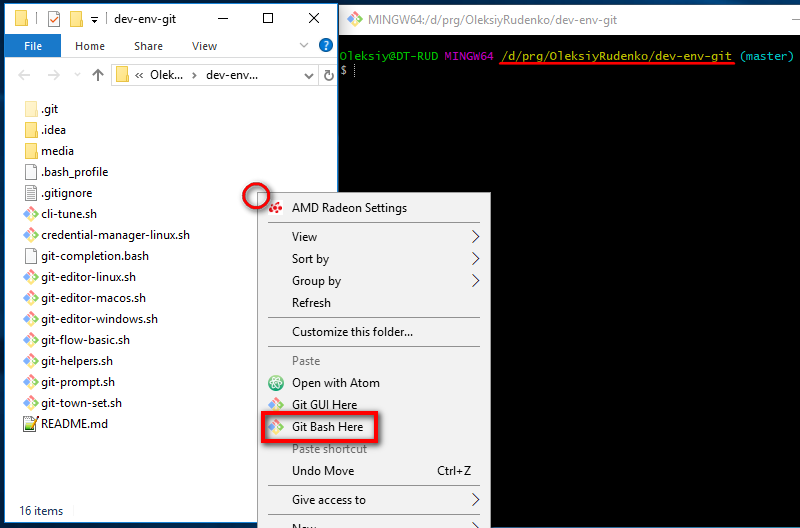

[![Kottans-Frontend][badge-kottans]][kottans-git]
[![MIT Licensed][badge-mit]][license]
![Entry level: beginner][badge-beginner]

# Linux CLI

<!-- START doctoc generated TOC please keep comment here to allow auto update -->
<!-- DON'T EDIT THIS SECTION, INSTEAD RE-RUN doctoc TO UPDATE -->
## Table of Contents

- [Why mastering this?](#why-mastering-this)
- [Targets](#targets)
  - [Absolute minimum](#absolute-minimum)
  - [Nice to have](#nice-to-have)
- [Learn and Practise](#learn-and-practise)
  - [Extra materials](#extra-materials)
- [Practice](#practice)
- [When completed](#when-completed)

<!-- END doctoc generated TOC please keep comment here to allow auto update -->
<!-- generated with [DocToc](https://github.com/thlorenz/doctoc) -->

## Why mastering this?

As a developer you will need to employ certain basic Linux CLI
skills in navigating across file system, manipulating files,
executing scripts.

The following modules on Git will require Linux CLI skills as well.

## Targets

Having this module completed you would know
the effect of the commands listed and
also know how to accomplish some typical tasks.

The classification below is heavily opinionated, yet
you will benefit from mastering all of the below described.

When mastering Linux CLI basics check yourself against
the list below.

### Absolute minimum

You know effects of the following commands:
```
ls	
cd	
cd ~/	
cd /	
cd ..	
touch	
mkdir	
echo	
echo "Some text" > smth	
echo "Some text" >> smth	
cp	
mv	
rm	
rm -rf	
rmdir	
pwd	
cat	
less	
chmod	
sudo	
```

Tasks (using command line only):
* List directory contents	
* Navigate to an arbitrary location within the file system	
* Navigate to a current user home directory	
* Create a directory	
* Create an empty file	
* Create a file with some short text content	
* Add a line of text to a file	
* Dump file contents to terminal	
* Remove file(s)/directory	
* Redirect/pipe input/output	
* Launch a shell script	
* Remove files recursively	
* Identify current working directory	
* Install a package/piece of software	
* Make a file (script) executable	
* Execute a command with elevated user privileges	

### Nice to have

Commands/operations:
```
&&	
| (pipe operator)	
& (backgrounding operation)	
pushd/popd	
cd -
```

## Learn and Practise

1. [Linux Survival (4 modules)](https://linuxsurvival.com/linux-tutorial-introduction/)
   is an interactive online course covering the following topics:
   * navigation across file system
   * manipulating files
   * security, permissions, users and groups, user info
   * important locations in the file system
   * built-in help
   * output redirection and piping
   * printing
   * wild cards and patterns
   * finding files and text
   * processes

1. [Learn the Command Line (5 modules)](https://www.codecademy.com/learn/learn-the-command-line)

    **Note:** Completion of free content (Interactive Lessons) 
    is the required minimum, but Quizzes and Freeform Projects 
    should also be available via 7-day trial of Codecademy.
    Do them if you can, it's a great practice to cement your skills
    gained from the course above.

1. [Learning the Shell (10 modules)](http://linuxcommand.org/lc3_learning_the_shell.php)
   greatly supplements the previous courses offering a deeper
   insight into Linux Shell. Make sure to practise every command from
   the course in your Linux terminal.
   
   Need safe environment for this task? Use a 
   [virtual Linux CLI playground](https://katacoda.com/courses/ubuntu/playground)

Anything is not clear enough or want more practice?
Dive into the extra materials below.

### Extra materials

- [Linux utilities that every developer should know](https://blog.webbylab.com/linux_utilities_for_every_developer/)
- [101 Bash Commands and Tips for Beginners to Experts](https://dev.to/awwsmm/101-bash-commands-and-tips-for-beginners-to-experts-30je)
- RUS: [Быстрое изучение Bash: 30 легких команд для новичков](https://proglib.io/p/bash-commands-for-beginners/)
- RUS: [Конспект по bash, ч.1](https://proglib.io/p/bash-notes/)
- RUS: [Конспект по bash, ч.2](https://proglib.io/p/bash-notes2/)
- RUS: [Команды bash, о которых вы, возможно, не знали](https://proglib.io/p/hidden-features-bash/)
- [Command Line Essentials: Git Bash for Windows](https://www.udemy.com/git-bash/)
- RUS: [Основы командной строки](https://ru.hexlet.io/courses/cli-basics)

## Practice

Try doing as much as possible via CLI. Not so convenient as it would be
using the GUI as you get used to it, but you will find this skill beneficial
for your further learning and career.

<details><summary>A note for Windows users (CLICK to expand)</summary>
You may practice Linux CLI on your Windows machine
using Git Bash that gets installed along with
[Git](https://git-scm.com/downloads).

To open Git Bahs right click anywhere in file explorer and select
`Git Bash here` option. Bash will get opened in context of the
directory you called it at.


</details>

## When completed

Proceed to [Git basics](./git-basics.md)

---

[Course contents](../README.md)

[badge-kottans]: https://img.shields.io/badge/%3D(%5E.%5E)%3D-linux-yellow.svg
[kottans-git]: https://github.com/kottans/git-course

[badge-mit]: https://img.shields.io/badge/License-MIT-blue.svg
[license]: https://github.com/kottans/git-course/blob/master/LICENSE.md

[badge-beginner]: https://img.shields.io/badge/Entry%20level-beginner-brightgreen.svg
